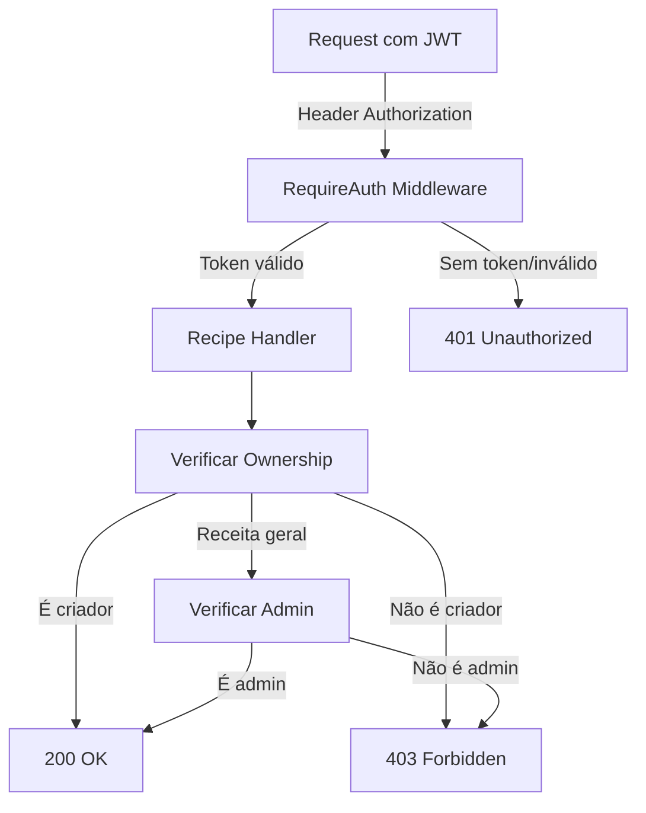

# Implementação do Sistema de Autorização de Receitas

## ✅ Implementação Completa

Este documento resume a implementação do sistema de autorização de receitas no projeto Receitas App.

## 📁 Arquivos Modificados/Criados

### Modificados (5 arquivos):

#### 1. `internal/models/user.go`
**Adicionado:**
- Campo `Role` (default: 'user', suporta 'admin')
- Função helper `IsAdmin()` (comentada para futuro)

```go
Role string `gorm:"default:'user';size:20" json:"role"` // 'user' ou 'admin'
```

#### 2. `internal/http/handlers/recipe.go`
**Modificado:**
- `CreateRecipe`: Requer autenticação, atribui `user_id`
- `UpdateRecipe`: Verifica ownership antes de atualizar
- `DeleteRecipe`: Verifica ownership antes de deletar
- **Adicionado**: Função `canModifyRecipe()` para verificar permissões

**Lógica de Autorização:**
```go
func canModifyRecipe(recipe *models.Recipe, userID uint) bool {
    if recipe.UserID != nil {
        return *recipe.UserID == userID // Apenas criador
    }
    return false // Receitas gerais bloqueadas (apenas admin futuro)
}
```

#### 3. `internal/http/routes/routes.go`
**Modificado:**
- Rotas públicas: GET /recipes, GET /recipes/{id}
- Rotas protegidas: POST, PUT, DELETE (requerem `RequireAuth`)

```go
// Públicas
r.With(RateLimitRead).Get("/", handlers.ListRecipes)
r.With(RateLimitRead).Get("/{id}", handlers.GetRecipe)

// Protegidas
r.With(RequireAuth, RateLimitWrite).Post("/", handlers.CreateRecipe)
r.With(RequireAuth, RateLimitWrite).Put("/{id}", handlers.UpdateRecipe)
r.With(RequireAuth, RateLimitWrite).Delete("/{id}", handlers.DeleteRecipe)
```

#### 4. `pkg/validation/validator.go`
**Adicionado:**
- Tradução do campo `Role` → "papel"

#### 5. `README.md`
**Atualizado:**
- Seção "Receitas e Usuários" com informações de autorização
- Exemplos de uso com tokens
- Códigos de resposta (401, 403)

### Criados (2 arquivos):

#### 1. `test/recipe_authorization_test.go`
**Testes implementados:**
- ✅ Criar receita sem auth → 401
- ✅ Criar receita com auth → 201 + user_id
- ✅ Editar receita própria → 200
- ✅ Editar receita alheia → 403
- ✅ Deletar receita própria → 200
- ✅ Deletar receita alheia → 403
- ✅ Editar receita geral (non-admin) → 403

#### 2. `insomnia-collection.json`
**Atualizado:**
- Adicionado header `Authorization` nos endpoints protegidos
- Descrições atualizadas com requisitos de auth
- Data de export atualizada

## 🔒 Regras de Autorização Implementadas

### Criar Receita (POST /recipes)
✅ **Requer autenticação**  
- Token JWT obrigatório no header `Authorization: Bearer <token>`
- Receita automaticamente atribuída ao usuário (`user_id`)
- Retorna 401 se não autenticado

### Listar Receitas (GET /recipes)
✅ **Público**  
- Sem autenticação necessária
- Retorna todas as receitas (gerais e personalizadas)

### Visualizar Receita (GET /recipes/{id})
✅ **Público**  
- Sem autenticação necessária
- Qualquer um pode visualizar qualquer receita

### Editar Receita (PUT /recipes/{id})
✅ **Requer autenticação + ownership**  
- Token JWT obrigatório
- Verifica se `recipe.user_id == user_id do token`
- Retorna 401 se não autenticado
- Retorna 403 se não for o criador
- Receitas gerais (user_id = null): bloqueadas (apenas admin futuro)

### Deletar Receita (DELETE /recipes/{id})
✅ **Requer autenticação + ownership**  
- Mesma lógica do editar
- Soft delete (mantém registro com deleted_at)

## 📊 Fluxo de Autorização



## 🎯 Mensagens de Erro

### 401 Unauthorized
```json
{
  "error": {
    "title": "Ops, algo deu errado!",
    "message": "Autenticação necessária"
  }
}
```

**Quando ocorre:**
- Token ausente
- Token inválido
- Token expirado
- Token na blacklist

### 403 Forbidden
```json
{
  "error": {
    "title": "Ops, algo deu errado!",
    "message": "Você não tem permissão para modificar esta receita"
  }
}
```

**Quando ocorre:**
- Tentativa de editar receita de outro usuário
- Tentativa de deletar receita de outro usuário
- Usuário não-admin tentando modificar receita geral

## 📝 Exemplos de Uso

### 1. Criar Receita (Autenticado)

**Request:**
```bash
curl -X POST http://localhost:8080/recipes \
  -H "Authorization: Bearer eyJhbGc..." \
  -H "Content-Type: application/json" \
  -d '{
    "title": "Minha Receita",
    "prep_time": 30,
    "servings": 4
  }'
```

**Response (201):**
```json
{
  "id": 1,
  "title": "Minha Receita",
  "prep_time": 30,
  "servings": 4,
  "user_id": 5,
  "created_at": "2025-12-26T14:00:00Z"
}
```

### 2. Editar Receita Própria

**Request:**
```bash
curl -X PUT http://localhost:8080/recipes/1 \
  -H "Authorization: Bearer eyJhbGc..." \
  -H "Content-Type: application/json" \
  -d '{"title": "Receita Atualizada"}'
```

**Response (200):** Receita atualizada

### 3. Tentar Editar Receita Alheia

**Request:**
```bash
curl -X PUT http://localhost:8080/recipes/1 \
  -H "Authorization: Bearer TOKEN_OUTRO_USER" \
  -H "Content-Type: application/json" \
  -d '{"title": "Hack"}'
```

**Response (403):**
```json
{
  "error": {
    "title": "Ops, algo deu errado!",
    "message": "Você não tem permissão para modificar esta receita"
  }
}
```

### 4. Listar Receitas (Público)

**Request:**
```bash
curl http://localhost:8080/recipes
```

**Response (200):** Lista todas as receitas (funciona sem token)

## 🔧 Preparação para Sistema de Admin

### Campo Role Adicionado

O campo `role` foi adicionado ao model User com valor default `'user'`.

**Estrutura:**
```go
type User struct {
    // ... outros campos
    Role string `gorm:"default:'user';size:20" json:"role"`
}
```

**Valores suportados:**
- `user` - Usuário comum (default)
- `admin` - Administrador (futuro)

### Função canModifyRecipe

A função está preparada para suportar admins:

```go
func canModifyRecipe(recipe *models.Recipe, userID uint) bool {
    if recipe.UserID != nil {
        return *recipe.UserID == userID
        // TODO: || isAdmin(userID)
    }
    return false // TODO: isAdmin(userID)
}
```

**Para implementar admin no futuro:**
1. Descomentar TODOs na função `canModifyRecipe`
2. Criar função `isAdmin(userID uint) bool`
3. Criar middleware `RequireAdmin`
4. Adicionar rotas `/admin/*`

### Script para Promover Admin

Para promover um usuário a admin manualmente:

```sql
-- Via SQL direto
UPDATE users SET role = 'admin' WHERE email = 'admin@example.com';
```

Ou via código Go (comentar/descomentar quando necessário):

```go
// Promover usuário a admin
func promoteUserToAdmin(db *gorm.DB, email string) error {
    return db.Model(&models.User{}).
        Where("email = ?", email).
        Update("role", "admin").Error
}
```

## 🧪 Testes

### Testes Criados

**Arquivo:** `test/recipe_authorization_test.go`

**7 cenários testados:**
1. ✅ Criar sem autenticação
2. ✅ Criar com autenticação
3. ✅ Editar receita própria
4. ✅ Editar receita de outro usuário
5. ✅ Deletar receita própria
6. ✅ Deletar receita de outro usuário
7. ✅ Editar receita geral (não-admin)

**Executar:**
```bash
# Com DATABASE_URL configurado
export DATABASE_URL="postgres://..."
go test -v ./test/recipe_authorization_test.go
```

## 🔐 Segurança

### Implementado

✅ **Autenticação obrigatória** para criar/editar/deletar  
✅ **Verificação de ownership** antes de modificar  
✅ **Proteção de receitas gerais** (apenas admin futuro)  
✅ **Endpoints públicos** para listar/visualizar  
✅ **Rate limiting** mantido em todas rotas  
✅ **Logs contextualizados** com user_id

### Camadas de Proteção

1. **Middleware RequireAuth**: Valida JWT e extrai userID
2. **Handler**: Verifica ownership com `canModifyRecipe()`
3. **Database**: Soft delete preserva histórico
4. **Rate Limiting**: Proteção contra abuso

## 📈 Compatibilidade

### Receitas Existentes

**Receitas com `user_id = null` (criadas antes da autorização):**
- ✅ Podem ser listadas
- ✅ Podem ser visualizadas
- ❌ Não podem ser editadas (aguardando admin)
- ❌ Não podem ser deletadas (aguardando admin)

**Migração opcional:**
```sql
-- Atribuir receitas órfãs ao primeiro admin
UPDATE recipes 
SET user_id = (SELECT id FROM users WHERE role = 'admin' LIMIT 1)
WHERE user_id IS NULL;
```

### API Pública

- GET /recipes continua público
- GET /recipes/{id} continua público
- Clientes sem autenticação funcionam normalmente para leitura

## 🎯 Próximos Passos Sugeridos

### Fase 1: Sistema de Admin (Prioridade)
1. Implementar verificação de admin em `canModifyRecipe`
2. Criar middleware `RequireAdmin`
3. Adicionar rotas `/admin/recipes/*`
4. Permitir admins editarem receitas gerais

### Fase 2: Perfil de Usuário
1. GET /users/me - Dados do usuário logado
2. PUT /users/me - Atualizar perfil
3. GET /users/me/recipes - Receitas do usuário

### Fase 3: Recursos Avançados
1. Transferir ownership de receita
2. Múltiplos admins/moderadores
3. Logs de auditoria de modificações
4. Dashboard de estatísticas

## ✅ Checklist de Implementação

- [x] Campo Role adicionado ao User
- [x] Função canModifyRecipe implementada
- [x] CreateRecipe requer autenticação
- [x] UpdateRecipe verifica ownership
- [x] DeleteRecipe verifica ownership
- [x] Rotas atualizadas com RequireAuth
- [x] Validações traduzidas (Role)
- [x] Testes de autorização criados
- [x] README atualizado
- [x] Insomnia collection atualizada
- [x] Compilação bem-sucedida
- [x] Preparado para sistema de admin

## 🎉 Conclusão

Sistema de autorização de receitas completo e funcional!

**Características:**
- ✅ Autenticação JWT integrada
- ✅ Controle de acesso por ownership
- ✅ Preparado para sistema de admin
- ✅ Testes automatizados
- ✅ Documentação completa
- ✅ Compatibilidade com dados existentes

---

**Desenvolvido em**: 26/12/2025  
**Tempo de implementação**: ~2 horas  
**Arquivos modificados**: 5  
**Arquivos criados**: 2  
**Linhas de código**: ~300 linhas  
**Testes**: 7 cenários ✅

